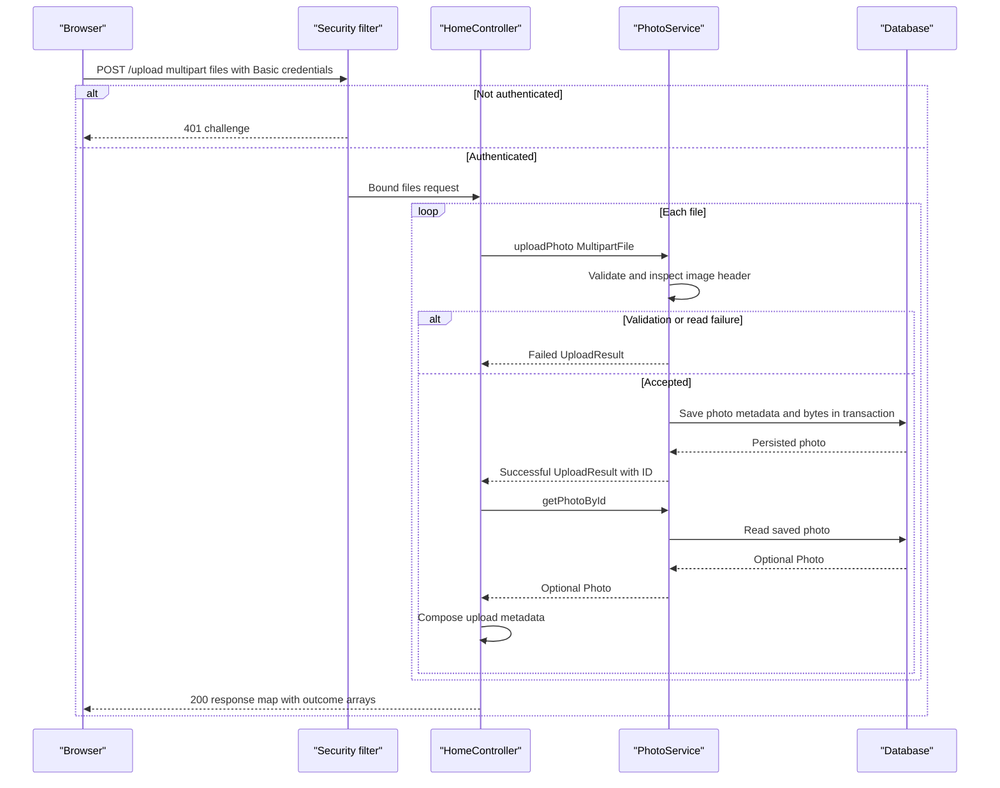

# API & Service Communication Contracts

Five explicit controller endpoints expose HTML gallery/detail views, a multipart upload JSON response, image bytes and deletion redirects. Requests use synchronous in-process service calls; no inter-service API gateway or asynchronous message contract was found.

## Service Catalog

| Service | Port | Category | Purpose |
|---|---|---|---|
| `photo-album` Maven module / `photoalbum-java-app` Compose service | 8080 | API Layer and Business | Source-built application; MVC, Thymeleaf, Data JPA and Security starters |
| `oracle-db` Compose service | 1521 | Infrastructure | Third-party Oracle Free database container; not a source-built API service |

Evidence: `pom.xml:15-19,30-101`, `docker-compose.yml:3-44`. Azure setup describes AKS, ACR and PostgreSQL provisioning, but no checked-in application Deployment establishes additional callable services.

## API Endpoints Inventory

| Service/controller | Method | Path | Request Type | Response Type |
|---|---|---|---|---|
| Photo Album / `HomeController` | GET | `/` | No declared parameters | 200 HTML `index`; model contains `List<Photo>` and timestamp; caught retrieval errors render empty gallery |
| Photo Album / `HomeController` | POST | `/upload` | Multipart `files`: `List<MultipartFile>` | 200 JSON map with `success`, `uploadedPhotos`, `failedUploads`; 400 map for bound null/empty list; absent required part can fail binding before handler |
| Photo Album / `DetailController` | GET | `/detail/{id}` | String path `id` | 200 HTML `detail` with `Photo` and adjacent IDs; redirect to `/` for missing record or caught error |
| Photo Album / `DetailController` | POST | `/detail/{id}/delete` | String path `id`, no DTO body | Redirect to `/` with success/error flash message, including not-found/error branches |
| Photo Album / `PhotoFileController` | GET | `/photo/{id}` | String path `id` | 200 `ResponseEntity<Resource>` image bytes using stored MIME; 404 missing/empty data; 500 caught exception |

The two POST endpoints require Basic authentication; unauthenticated requests are rejected by the security filter (normally 401), independently of handler responses. Image responses set `Cache-Control`, `Pragma`, `Expires`, `X-Photo-ID`, `X-Photo-Name` and `X-Photo-Size`. No API versioning or custom multipart-limit exception response is declared.

Evidence: `src/main/java/com/photoalbum/controller/HomeController.java:37-98`, `DetailController.java:32-79`, `PhotoFileController.java:37-87`; `src/main/java/com/photoalbum/config/SecurityConfig.java:46-62`.

## Management & Observability Endpoints

| Service | Endpoint | Custom Metrics (if any) |
|---|---|---|
| Photo Album | No explicitly configured management, health, Swagger or metrics endpoint found | No custom metrics annotations/registrations found |
| Oracle | Compose health check runs container `healthcheck.sh`, not an HTTP API | None declared |

No Actuator, Springdoc or metrics-export dependency appears in `pom.xml`. Framework-generated error/static-resource handling is not counted as an explicit controller endpoint.

## DTOs & Contracts

- `Photo` is a mutable service-owned entity used in server-rendered view models; it is not returned wholesale as the upload JSON body.
- `UploadResult` is a mutable per-file internal service result, not the controller's serialized response DTO.
- `HomeController` constructs mutable `Map<String,Object>` response contracts and arrays of upload metadata/error maps. There is no typed immutable gateway aggregation DTO.
- Boot's JSON starter provides the JSON infrastructure; no custom Jackson serializer/configuration, OpenAPI file, protobuf or GraphQL schema was found.
- Entity field details are in [data architecture](data-architecture.md). Upload rejection is conveyed as per-file errors inside a 200 response, not generally as 400 for every failed file.

## Communication Patterns

Browser-to-app HTTP, direct controller-to-service calls and database JDBC operations are synchronous. JavaScript uses an asynchronous browser `fetch`, but this is not backend event-driven messaging. No broker, service discovery, client-side balancing, gateway composition, circuit breaker, application retry or configured remote-call timeout was found. Compose `restart: on-failure` is process restart, not request retry.

For upload response composition, each successful service result triggers a second photo lookup. If that lookup returns empty, the file is absent from both response arrays; if it throws, this handler has no surrounding catch to produce a controlled partial response. Transaction-proxy commit failures can also propagate outside the service's internal catch.

API availability depends on Oracle readiness and required password properties; full startup configuration is in [configuration inventory](configuration-inventory.md). Writes require an authenticated account; the configured account carries ADMIN, but endpoint rules use `authenticated()`, not role checks or photo ownership checks. Reads are public. HTTP Basic is stateless, CSRF is disabled, and no application TLS configuration is present. Browser CDN requests use HTTPS; external TLS termination is not established by the checked-in application files.

## Service Technology Matrix

| Service | Web | Data Access | Discovery | Gateway | Actuator | Cache | Metrics |
|---|---|---|---|---|---|---|---|
| Photo Album | Spring MVC / Thymeleaf | Spring Data JPA / Oracle JDBC | None | None | Not declared | No application cache | No exporter declared |
| Oracle container | Not an app web service | SQL database | Compose service DNS | None | Not applicable | Database internals not assessed | Not declared |

## Service Communication Sequence

Database exceptions caught inside upload produce failed results where possible; transaction commit and post-upload lookup exceptions can instead propagate. No retry/circuit-breaker fallback is implied by this diagram. Static analysis only; no live endpoint requests or tests were run.
