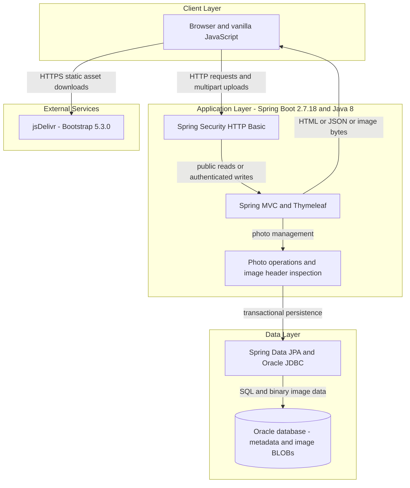
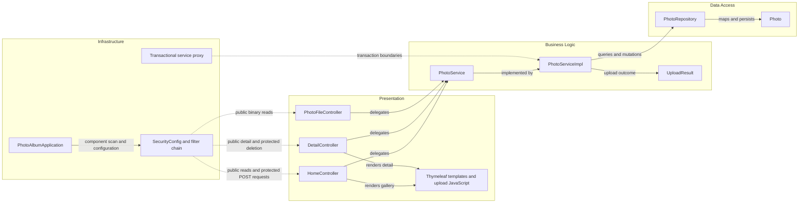

# Architecture Diagram

Evidence-based view of the checked-in Photo Album application, not a claim about deployed resources. The executable application is a single Maven module; Azure provisioning scripts describe a separate, incompletely connected infrastructure path.

## Application Architecture

### Technology Stack Summary

| Layer | Technology | Version | Purpose |
|---|---|---|---|
| Runtime/build | Java; Maven | Java target 8; Docker Maven 3.9.6 | Executable JAR |
| Application | Spring Boot | 2.7.18 | Auto-configuration and application startup |
| Presentation | Spring MVC, Thymeleaf, vanilla JavaScript | Boot-managed; JavaScript unversioned | Gallery/detail HTML and multipart upload JSON |
| Browser styling | Bootstrap from jsDelivr | 5.3.0 | Responsive gallery and controls |
| Access control | Spring Security, BCrypt | Boot-managed | Stateless HTTP Basic for upload/delete |
| Business | Java ImageIO | JRE 8 | Header-based image dimensions and pixel budget |
| Persistence | Spring Data JPA, Hibernate, ojdbc8 | Parent-managed, no explicit child versions | Entity persistence and Oracle-native queries |
| Storage | Oracle Free container | `gvenzl/oracle-free:latest`, not pinned | Metadata and image BLOBs; persistent Compose volume |
| Test storage | H2 | Parent-managed | Test profile only; not production storage |

Evidence: `pom.xml:8-109`, `Dockerfile:1-31`, `docker-compose.yml:1-50`, `src/main/resources/templates/layout.html:7-42`.

### Data Storage & External Services

`Photo` stores binary image data in the database, together with display metadata. Generated `/uploads/` paths are compatibility metadata, not the active upload destination; image serving reads database bytes. Compose runs Oracle and the application on a bridge network. Browser styling/scripts depend on jsDelivr; no application message broker, remote photo service, or external cache was found. `azure-setup.ps1` provisions ACR, AKS and PostgreSQL 15, but the application still declares Oracle JDBC, Oracle dialect and Oracle-specific queries; those scripts do not establish a working PostgreSQL application deployment. See [configuration inventory](configuration-inventory.md).

### Key Architectural Decisions

- Constructor-injected controllers delegate to one transactional photo service and a Spring Data repository.
- Image bytes and metadata share one entity/store; uploads do not write new filesystem images.
- Public read access is separated from authenticated mutations; no per-photo ownership model is implemented.

## Component Relationships

### Component Inventory

| Component | Layer | Type | Responsibility |
|---|---|---|---|
| `PhotoAlbumApplication` | Infrastructure | Boot entry point | Starts context and scans application package |
| `SecurityConfig` | Infrastructure | Configuration/filter chain | In-memory BCrypt account and Basic authentication |
| `HomeController` | Presentation | MVC controller | Gallery model and upload result composition |
| `DetailController` | Presentation | MVC controller | Single-photo view, adjacent-photo lookup and deletion |
| `PhotoFileController` | Presentation | Binary resource controller | Streams bytes with MIME and no-cache headers |
| `index.html`, `detail.html`, `layout.html`, `upload.js` | Presentation | Templates/browser script | UI rendering, file selection and upload feedback |
| `PhotoService` | Business logic | Service interface | Photo retrieval, navigation, upload and deletion contract |
| `PhotoServiceImpl` | Business logic | Transactional service | Validates uploads, extracts dimensions and persists bytes |
| `UploadResult` | Business logic | Mutable result POJO | Per-file success/failure outcome |
| `PhotoRepository` | Data access | Spring Data repository | CRUD plus Oracle-native finder queries |
| `Photo` | Data access | JPA entity | Metadata and binary image storage |
| `MathUtil` | Utility | Static helper | GCD helper; no reference in the traced photo workflows |

Evidence: `src/main/java/com/photoalbum/PhotoAlbumApplication.java:9-14`, `config/SecurityConfig.java:25-62`, `controller/HomeController.java:23-98`, `controller/DetailController.java:17-79`, `controller/PhotoFileController.java:22-87`, `service/impl/PhotoServiceImpl.java:28-237`, `repository/PhotoRepository.java:15-100`, `model/Photo.java:15-108` (Java paths relative to `src/main/java/com/photoalbum/`).

Static analysis only: no execution, deployment, or diagram-rendering test was performed.
