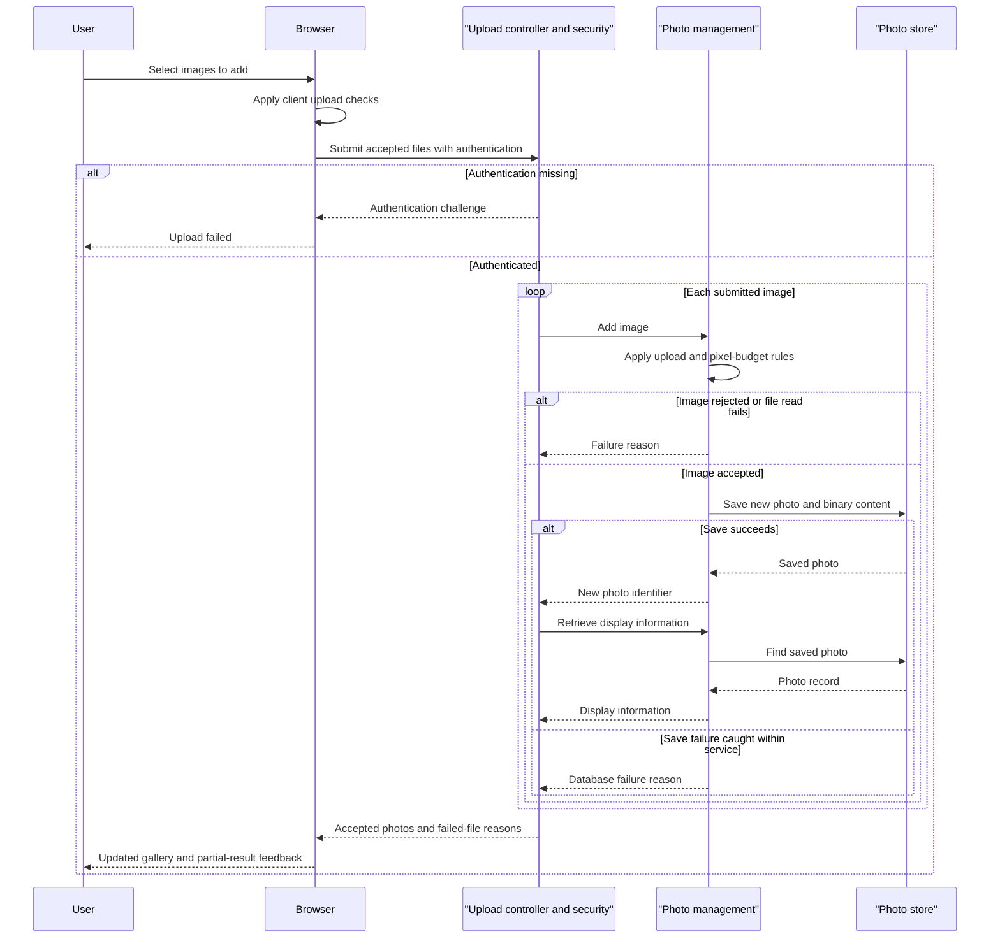

# Core Business Workflows

Photo Album lets users upload images, browse a newest-first gallery, inspect individual images with adjacent-photo navigation, and delete photos. Reads are public; mutations require an authenticated account.

## Domain Entities

| Entity | Service / Bounded Context | Description | Key Relationships |
|---|---|---|---|
| `Photo` | Photo Album / photo management | Uploaded image and its display metadata | Standalone aggregate; navigation derives older/newer neighbors by upload time |
| `UploadResult` | Photo Album / upload outcome | Per-file acceptance or failure information | Refers to accepted photo ID or rejected filename; not persisted |

Persistence field definitions are in [data architecture](data-architecture.md); no album, owner, tag or other domain aggregate is modeled.

## Service-to-Domain Mapping

| Service | Domain Context | Owned Entities | External Dependencies |
|---|---|---|---|
| `PhotoService` / `PhotoServiceImpl` in single Photo Album module | Photo management | `Photo`; produces `UploadResult` | Database via repository; local image-header reader |

There are no independently deployed business contexts or domain events. All controllers use the same service as the source of truth.

## Primary Workflows

### Workflow 1: Upload multiple photos with partial results

1. User selects/drops files; browser applies the client upload checks and sends accepted files to `POST /upload`.
2. The security filter requires authentication. The controller rejects an empty bound collection, otherwise iterates files.
3. For each file, the service applies server upload rules, generates compatibility identifiers and inspects the image header using the pixel-budget rule.
4. Accepted data becomes a new photo with upload time and optional dimensions; the service saves image bytes and metadata together.
5. The controller looks up each successful photo again and constructs upload feedback metadata; failures contribute filename/error entries.
6. Browser displays successes/errors and prepends cards for successful uploads. A failed file does not intentionally cancel previously committed uploads.

No atomic batch or automatic retry is implemented. A missing post-save lookup is silently omitted from both response lists, while a lookup/commit exception can escape the controller rather than produce per-file feedback. Image format/header limitations can lead to a saved photo without dimensions.

Evidence: `src/main/resources/static/js/upload.js:60-132,135-158`; `src/main/java/com/photoalbum/controller/HomeController.java:55-98`; `src/main/java/com/photoalbum/service/impl/PhotoServiceImpl.java:81-192`.

### Workflow 2: Browse gallery and inspect neighboring photos

1. Gallery entry loads all photos newest-first and renders display cards.
2. A retrieval exception is logged and the page instead shows an empty gallery; the response does not distinguish no data from failed data access.
3. Detail entry loads the selected photo and independently looks up older/newer neighbors.
4. Missing record or a caught detail error redirects to the gallery. Neighbor links are only available when lookup returns a record.
5. Image retrieval returns stored image bytes. Missing photo/empty bytes return not-found; caught serving errors return a server error.

Evidence: `HomeController.java:37-49`, `DetailController.java:32-58`, `PhotoFileController.java:37-87`, `PhotoServiceImpl.java:54-75,223-237` under `src/main/java/com/photoalbum/`.

### Workflow 3: Delete a photo

1. User confirms the detail-page deletion form; server mutation requires authentication.
2. Service looks up the photo. A missing photo returns false; an existing photo is deleted with its image bytes.
3. Controller redirects to the gallery with success/not-found/failure flash feedback. There is no soft-delete, undo or separate filesystem delete step.

Evidence: `src/main/resources/templates/detail.html` deletion form; `src/main/java/com/photoalbum/controller/DetailController.java:64-79`; `service/impl/PhotoServiceImpl.java:198-217`.

## Cross-Service Data Flows

No business-service aggregation, event choreography or gateway composition exists. Upload response composition is local: per-file result → saved-photo lookup → metadata/error arrays. Browser image content is retrieved separately from gallery metadata. The database is the only application data integration; browser Bootstrap downloads do not exchange business records.

Failure degradation is explicitly local: gallery lookup failure renders empty data, missing detail redirects, and rejected files yield partial upload feedback. There is no circuit breaker or cached fallback to describe.

## Business Workflow Sequence

The save-failure branch represents exceptions caught in the service, not every transaction commit failure. There is no invented downstream-service fallback.

## Business Rules & Decision Logic

- **Client upload checks:** MIME must be JPEG, PNG, GIF or WebP; file size must be at most 10 MiB. The UI does not enforce the declared max-file-count property or reject zero-byte files itself.
- **Server upload checks:** lowercased declared MIME must be in the configured allowlist; size must be positive and not exceed 10,485,760 bytes by default. A null MIME triggers the outer generic-error catch rather than a specific validation message.
- **Pixel-budget rule:** if an ImageIO reader recognizes the header, width × height must not exceed 40,000,000 pixels. Unsupported reader or non-I/O dimension-extraction errors can continue without dimensions; an IOException rejects the upload. Declared MIME is not proof of successful image decoding; no WebP reader dependency is declared.
- **Multipart bounds:** framework limits are 10 MB per file and 50 MB per request. `app.file-upload.max-files-per-upload=10` is declared but not read/enforced by the controller/service.
- **Entity validation:** original/stored names are nonblank with maximum 255 characters; MIME nonblank maximum 50; compatibility path maximum 500; file size nonnull/positive; upload timestamp nonnull. These are entity annotations, not controller `@Valid` request DTO validation.
- **Identity/lifecycle:** constructors assign UUID and current local time; workflow is new → persisted → physically deleted. No ownership, deduplication, approval, album capacity or retention policy is modeled.
- **Navigation:** older/newer comparisons are strict by upload time; first returned record is chosen. Equal timestamps have no specified neighbor ordering.
- **Transactions:** service-level transactions, with read-only retrieval/navigation; each upload invocation commits separately. No saga/compensation or batch transaction.
- **Error handling:** per-file service errors where caught; empty-gallery and redirect fallbacks; image not-found/server-error responses; delete flash feedback. Deferred commit errors can escape local catches.
- **Audit:** operational logs include IDs, filenames and image-serving diagnostics; no dedicated audit trail/change-history model is found.
- **Authorization:** upload/delete require authenticated access; configured account has ADMIN but no role-specific or photo-owner rule. Public read access, stateless Basic auth and disabled CSRF are in `SecurityConfig.java:46-62`; no application TLS configuration is declared.

Sources: `model/Photo.java:24-91`, `service/impl/PhotoServiceImpl.java:28-47,81-192,223-237`, `config/SecurityConfig.java:34-62` relative to `src/main/java/com/photoalbum/`, and the property/browser files cited above. No schedules, event listeners or startup domain seeding were found. Static tracing only; no business workflow was executed.
