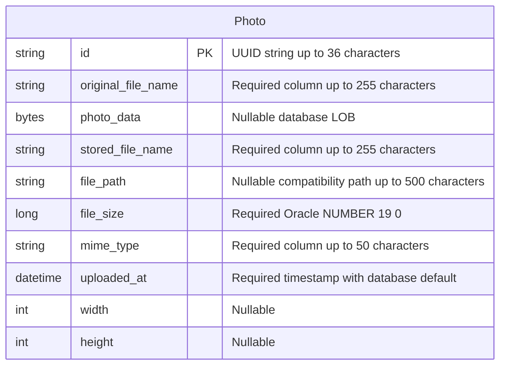

# Data Architecture & Persistence Layer

One JPA entity owns image metadata and binary content in Oracle, with an H2 test profile. Oracle-native repository SQL introduces database-specific behavior beyond ordinary JPA CRUD.

## Database Configuration

| Service/Module | DB Type | Profile | Driver | Connection | Migration Tool |
|---|---|---|---|---|---|
| Photo Album | Oracle | Default | `oracle.jdbc.OracleDriver` / runtime ojdbc8 | Environment-overridable JDBC URL; default Oracle service `oracle-db:1521/FREEPDB1`; separate credentials | None declared; Hibernate recreates schema at startup |
| Photo Album | Oracle | `docker` | Same Oracle driver | Compose database hostname and application schema credentials | Same Hibernate schema recreation; container init scripts grant schema privileges |
| Photo Album test context | H2 in-memory | `test` | `org.h2.Driver` / test-scope H2 | In-memory `testdb`; test-local credential setting masked | Hibernate creates/drops schema; no versioned migration |
| Azure provisioning only | PostgreSQL 15 | No application profile found | No PostgreSQL JDBC dependency declared | Script constructs Azure server JDBC URL and writes `.env`; no application binding shown | Script provisions database/user grants, not application entity migration |

Evidence: `src/main/resources/application.properties:9-21`, `application-docker.properties:1-17`, `src/test/resources/application-test.properties:1-10`, `pom.xml:43-54,88-93`, `azure-setup.ps1:117-138,199-299`. No explicit connection-pool tuning, Flyway/Liquibase configuration, domain seed data or versioned application schema scripts were found. Raw properties are in [configuration inventory](configuration-inventory.md).

## Data Ownership per Service

| Service | Tables Owned | ORM Framework | Caching | Notes |
|---|---|---|---|---|
| Photo Album | `photos` | JPA/Hibernate via Spring Data JPA | No explicit application/second-level cache configured | Single entity with binary LOB; application schema managed by Hibernate |

## Entity Model

`Photo` is owned solely by Photo Album; no FK relationships, join entities, cascade settings or bidirectional mappings exist. Source: `src/main/java/com/photoalbum/model/Photo.java:15-108`. The model maps `photos`, adds a non-unique `idx_photos_uploaded_at` index and uses application-generated UUIDs/upload timestamps. Java types are `String`, `byte[]`, `Long`, `LocalDateTime`, and nullable `Integer` dimensions. The LOB has no explicit lazy-fetch annotation. Oracle-specific column definitions include numeric precision and a `SYSTIMESTAMP` default. Entity validation rules are documented once in [business workflows](business-workflows.md).

`PhotoServiceImpl` is class-level transactional; listing, ID lookup and navigation are marked read-only. Each externally invoked upload is a separate service transaction, not a transaction around the whole multi-file controller loop. Entity binary content and metadata are saved/deleted together; no filesystem compensation is needed in the active implementation. Evidence: `service/impl/PhotoServiceImpl.java:28-29,54-75,160-237` relative to `src/main/java/com/photoalbum/`.

## Key Repository Methods

| Service | Repository | Notable Methods | Purpose |
|---|---|---|---|
| Photo Album | `PhotoRepository` (`JpaRepository<Photo,String>`) | `List<Photo> findAllOrderByUploadedAtDesc()` | Native SQL full gallery, newest first, including BLOB column |
| Photo Album | Same | `List<Photo> findPhotosUploadedBefore(LocalDateTime uploadedAt)` | Strictly older records, descending time, Oracle ROWNUM cap of 10 |
| Photo Album | Same | `List<Photo> findPhotosUploadedAfter(LocalDateTime uploadedAt)` | Strictly newer records, ascending time, Oracle NVL path fallback; no row cap |
| Photo Album | Same | `List<Photo> findPhotosByUploadMonth(String year,String month)` | Oracle TO_CHAR year/month filtering |
| Photo Album | Same | `List<Photo> findPhotosWithPagination(int startRow,int endRow)` | Nested Oracle ROWNUM pagination |
| Photo Album | Same | `List<Object[]> findPhotosWithStatistics()` | Windowed rank and running size total |

Source: `src/main/java/com/photoalbum/repository/PhotoRepository.java:15-100`. Standard `findById`, `save` and `delete` are inherited and used; custom method inventory above omits the rest of inherited CRUD. Only the gallery and before/after finders are called by the traced service; month/pagination/statistics finders have no exposed workflow in that service. Navigation selects the first result; equal upload timestamps have no ID tie-breaker and are excluded by strict comparisons.

## Caching Strategy

No explicit Spring Cache, Redis, EhCache, Caffeine, JCache or Hibernate second-level cache configuration was found. Images are intentionally sent with no-cache/no-store headers and browser uploads add a timestamp query parameter; these disable reuse rather than implementing a cache-aside layer. Gallery/detail templates read images by ID. Cache TTLs, eviction rules and regions are therefore not declared. Evidence: `controller/PhotoFileController.java:74-83` and `src/main/resources/static/js/upload.js:176-179`.

## Data Ownership Boundaries

This is one application-owned schema rather than database-per-microservice or a shared database across business services. Controllers all access the same service/repository in process. No cross-service data composition, bulk aggregation boundary, outbox, CQRS read store or event replication was found. The database contains both photo bytes and metadata; `storedFileName`/`filePath` are legacy compatibility metadata. A checked-in static JPEG is not evidence that new uploads are filesystem-backed.

Azure provisioning's PostgreSQL resource is not a second operational application store: the code and dependency/configuration baseline remain Oracle-specific. H2 configuration likewise does not demonstrate Oracle query compatibility, especially ROWNUM, NVL, TO_CHAR and Oracle-specific column definitions.

### Data Classification & Sensitivity

| Entity | Sensitive Fields | Classification (PII/PHI/PCI/None) | Controls in Place |
|---|---|---|---|
| `Photo` | Image content and original filename may identify people or contain user-supplied sensitive material | Potential PII; PHI/PCI not structurally modeled and uploaded content cannot be classified statically | Writes authenticated; reads public; no per-photo access controls, masking, field encryption or Oracle encryption-at-rest configuration found |
| `Photo` | UUID, timestamp, dimensions, MIME and size | Operational metadata; filename/content context may change sensitivity | No additional field-level controls found |

This does not assert actual photos contain PII or that a deployed database lacks platform encryption; neither image content nor deployed resources was inspected. Static analysis only; no database queries or tests were run.
