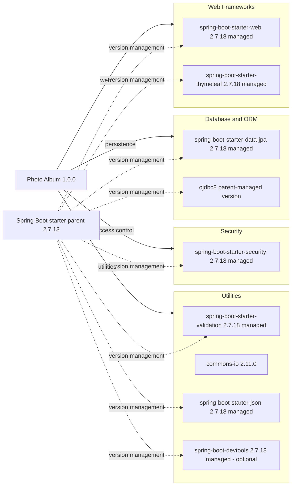

# Dependency Map

Photo Album (`com.photoalbum:photo-album:1.0.0`) declares 11 direct dependencies: 9 non-test and 2 test. This inventory uses only `pom.xml`; it does not infer direct dependencies from imports or attempt runtime dependency resolution.

## Dependencies

### Dependency Summary

| Category | Count | Key Libraries | Notes |
|---|---|---|---|
| Web Frameworks | 2 | `org.springframework.boot:spring-boot-starter-web`, `spring-boot-starter-thymeleaf` | Compile scope; versions omitted and parent-managed |
| Database / ORM | 2 | `org.springframework.boot:spring-boot-starter-data-jpa`; `com.oracle.database.jdbc:ojdbc8` | Starter compile; JDBC runtime; JDBC exact version not declared locally |
| Security | 1 | `org.springframework.boot:spring-boot-starter-security` | Compile, parent-managed |
| Utilities | 4 | `spring-boot-starter-validation`, `commons-io:commons-io:2.11.0`, `spring-boot-starter-json`, `spring-boot-devtools` | Compile; DevTools optional |

All Boot artifacts use group `org.springframework.boot`. For parent-managed artifacts, 2.7.18 is the parent/framework release, not an assertion that all transitive libraries share that version. Evidence: `pom.xml:8-101`.

### Version & Compatibility Risks

The declared Boot 2.7.18/Java 8 stack is an older framework generation; a move to Boot 3 requires Java 17 or later and Jakarta API changes. Oracle JDBC and the Commons IO pin need compatibility review when changing runtime/database. Exact resolved transitive versions and current vulnerability/support status were not checked; this is not a CVE assessment.

### Notable Observations

- No Maven profiles, modules, explicit BOM imports, or dependency lockfiles were found; one parent controls versions.
- `spring-boot-starter-json` is directly declared alongside the web starter; transitive overlap is expected but was not resolved here.
- DevTools is optional, not test-scoped; it remains in this declared non-test inventory.
- `spring-boot-maven-plugin` is declared without a version; build plugin management comes from the parent. It is not included in dependency counts.

## Test Dependencies

| Framework | Version | Notes |
|---|---|---|
| `org.springframework.boot:spring-boot-starter-test` | Parent-managed (Boot 2.7.18 release) | Test-scope starter; individual JUnit/Mockito/etc. versions are not declared locally |
| `com.h2database:h2` | Parent-managed, exact version not declared | Test-scope in-memory database |

Total test-scope dependencies: 2

No separately declared contract-testing or Testcontainers library is present. A test starter does not prove integration coverage or successful execution; no tests or dependency-resolution commands were run.
