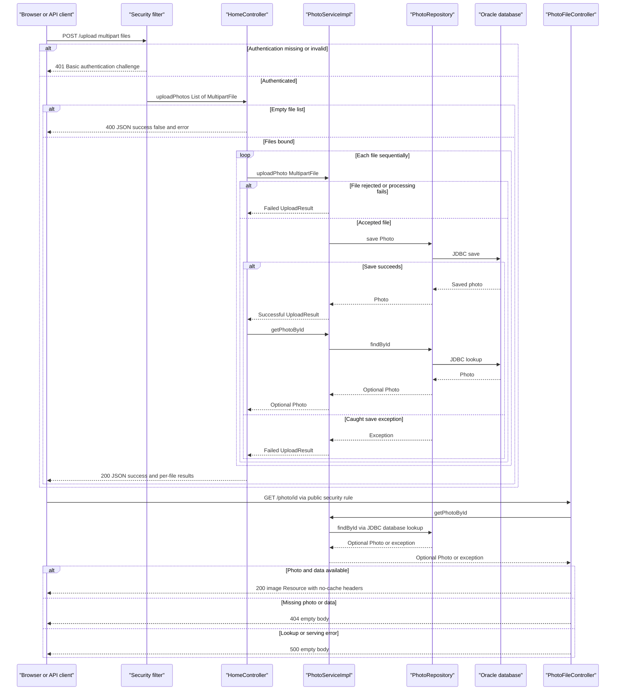

# API & Service Communication Contracts

Five explicitly mapped HTTP endpoints provide gallery/detail pages, multipart upload, deletion, and binary photo retrieval. Requests use synchronous controller-to-service calls; browser upload uses an asynchronous JavaScript invocation of the same synchronous HTTP API.

## Service Catalog

| Service | Port | Category | Purpose |
|---|---|---|---|
| `photoalbum-java-app` / Maven `com.photoalbum:photo-album` | 8080 HTTP, published as 8080 | Business; includes API layer | Source-built application serving the gallery and photo operations. |
| `oracle-db` | 1521, published as 1521 | Infrastructure | Third-party `gvenzl/oracle-free:latest` container supplying the application's database connection. |
| Azure Container Registry, script-defined | Not specified | Infrastructure | Image registry provisioned by the setup script; not an application API service. |
| Azure Kubernetes Service, script-defined | Application ingress not specified | Infrastructure | Hosting cluster provisioned by the setup script; no application deployment/ingress manifest identified. |
| Azure PostgreSQL Flexible Server, script-defined | Not explicitly specified | Infrastructure | Database provisioned by the setup script; current application source/configuration does not connect to it. |

Evidence: `pom.xml:15-21,30-79` defines one application artifact, with Web, Thymeleaf, Data JPA, Oracle JDBC, Validation, Security, and JSON starters; there are no Maven modules. `docker-compose.yml:1-44` distinguishes the third-party database from the source-built application. `Dockerfile:21-31` exposes the application port. `azure-setup.ps1:66-127` defines the three Azure resources, but does not establish a deployed application API contract. Script definitions are not evidence of live resources.

## API Endpoints Inventory

| Service / Controller | Method | Path | Request Type | Response Type |
|---|---|---|---|---|
| Application / `HomeController` | GET | `/` | No request DTO or declared query parameters | 200 HTML `index` view with `List<Photo>` in its model; retrieval exceptions produce the same view with an empty list. |
| Application / `HomeController` | POST | `/upload` | Multipart form with required repeated `files` parts bound to `List<MultipartFile>`; HTTP Basic authentication required | 200 JSON `Map<String,Object>` with `success`, `uploadedPhotos`, and `failedUploads`; explicit 400 JSON with `success=false` and `error` for a null/empty list; unauthenticated requests are challenged with 401. |
| Application / `DetailController` | GET | `/detail/{id}` | Path parameter `String id`; no body | 200 HTML `detail` view with `Photo` and previous/next identifiers; redirects to `/` (normally 302) for blank/missing photo or caught exceptions. |
| Application / `DetailController` | POST | `/detail/{id}/delete` | Path parameter `String id`; no body DTO; HTTP Basic authentication required | Redirect to `/` (normally 302) with success/error flash message, including missing photo and caught deletion errors; unauthenticated requests are challenged with 401. |
| Application / `PhotoFileController` | GET | `/photo/{id}` | Path parameter `String id`; no body | 200 `Resource` backed by `ByteArrayResource`, using the stored MIME type; empty-body 404 for missing photo/data or blank ID, empty-body 500 for caught exceptions. |

Evidence: `HomeController.java:37-98`, `DetailController.java:18-79`, and `PhotoFileController.java:23-87`, all under `src/main/java/com/photoalbum/controller/`; security behavior is defined in `src/main/java/com/photoalbum/config/SecurityConfig.java:45-61`.

**Contract details**

- No URL/header/query API versioning is declared. No PUT, DELETE, or PATCH mapping is present; deletion uses POST.
- Upload outcomes are per-file: application-level rejection can still yield HTTP 200 with failures, including when all files fail. `success` depends on whether the controller populated any successful upload entries. A required multipart parameter missing entirely is rejected by Spring binding before the explicit null/empty-list branch, normally with 400. No custom exception handler standardizes framework-generated binding/multipart errors.
- Multipart transport limits are 10 MB per file and 50 MB per request (`src/main/resources/application.properties:23-25`). An exact status/body for oversized multipart requests is not explicitly defined in application code. Validation details belong in [business-workflows.md](business-workflows.md).
- Successful upload metadata includes an identifier used for subsequent `/photo/{id}` requests. The emitted compatibility `filePath` is not the controller's retrieval URL (`PhotoServiceImpl.java:112-115,160-177`; `static/js/upload.js:178-179`, under `src/main/resources`).
- Binary retrieval emits `Cache-Control: no-cache, no-store, must-revalidate, private`, `Pragma: no-cache`, `Expires: 0`, plus `X-Photo-ID`, `X-Photo-Name`, and `X-Photo-Size` headers (`PhotoFileController.java:74-83`). It does not explicitly implement download disposition, byte-range, ETag, or conditional retrieval.
- Static assets and framework-provided error handling are not counted as explicitly mapped application endpoints.

## Management & Observability Endpoints

| Service | Endpoint | Custom Metrics (if any) |
|---|---|---|
| Application | None explicitly defined; no Actuator/Swagger/Prometheus dependency or controller found | None found; controllers/services use SLF4J logs, not custom metric registrations. |
| Oracle container | No HTTP management endpoint defined | Compose supplies a container health command, not a public API endpoint. |
| Script-defined Azure resources | No application management route defined in the provisioning script | No application metrics export identified. |

Evidence: complete dependencies in `pom.xml:30-101`, application controllers above, and `docker-compose.yml:17-22`. `/actuator/health`, `/swagger`, and `/health` must not be assumed available.

## DTOs & Contracts

| Type | API role | Mutability |
|---|---|---|
| `MultipartFile` / `List<MultipartFile>` | Framework-provided upload request contract; not an application JSON DTO | Framework-managed objects; not an immutable application record. |
| `Photo` | Service-level domain entity used in HTML view models and as the source of selected upload response metadata; not returned wholesale as JSON | Mutable POJO with setters. |
| `UploadResult` | Internal service result translated by the upload controller into successful/failed JSON entries; not directly returned | Mutable POJO with setters. |
| `Map<String,Object>` / lists of maps | Actual upload response envelope and per-file result contracts; no named response DTO | Mutable maps/lists. |
| `Resource` / `ByteArrayResource` | Binary image response body, not JSON | Spring resource abstraction. |

There are no gateway-level aggregation DTOs. Entity field lists and persistence details belong in [data-architecture.md](data-architecture.md). Evidence: `src/main/java/com/photoalbum/model/Photo.java:19,93-199`, `model/UploadResult.java:6-62`, and the controller signatures/construction cited above.

The JSON starters supply Jackson through Spring's normal response conversion; HTML uses Thymeleaf, and image responses use resource conversion. No explicit custom JSON serializers, Jackson annotations/configuration, OpenAPI/Swagger specification, protobuf, or GraphQL schema was identified in application source. `pom.xml:30-79` and `HomeController.java:55-98` support these serialization observations; exact date formatting is not an explicitly declared contract.

## Communication Patterns

- **Synchronous flow:** Browser HTTP requests enter controllers, which call `PhotoService`/`PhotoServiceImpl` directly; the service uses `PhotoRepository` synchronously. Database transport is Oracle JDBC, not REST. Evidence: controller constructor injection, `src/main/java/com/photoalbum/service/impl/PhotoServiceImpl.java:37-76,172-192,199-237`, `repository/PhotoRepository.java:16-27`, and `pom.xml:43-54`.
- **Browser async versus messaging:** `src/main/resources/static/js/upload.js:90-131` awaits `fetch('/upload')` and parses JSON. This is client-side asynchronous HTTP, not background server processing. No queue, event broker, pub/sub, gRPC, outbound REST client, or asynchronous server execution was found in application source/dependencies.
- **Aggregation:** The upload controller iterates files sequentially, then re-reads each successfully saved photo to compose metadata and collects failures. The detail controller combines a photo lookup with previous/next lookups into a view model. Both are intra-application composition, not gateway fan-out (`HomeController.java:68-95`; `DetailController.java:38-54`).
- **Resilience/fallbacks:** No circuit breaker, retry policy, bulkhead, or application-configured HTTP/JDBC timeout value was identified. Gallery errors degrade to an empty gallery; detail errors redirect home; delete errors use flash messages; file retrieval failures become 404/500. Upload service catches processing/save failures into `UploadResult`, but post-upload metadata lookup exceptions and transaction-boundary failures are not guaranteed to become per-file JSON failures (`PhotoServiceImpl.java:81-193`; `HomeController.java:68-97`). The browser displays generic network/non-2xx errors and does not retry (`upload.js:125-131`). Compose restart-on-failure is a process policy, not a request retry.
- **Discovery/gateway/load balancing:** No discovery registration, gateway, or client-side load balancing is implemented. Compose database communication uses the configured `oracle-db` hostname on its network; no application-level service registry is shown (`docker-compose.yml:31-43`). Azure cluster creation alone does not demonstrate ingress, gateway, or application balancing.
- **Availability:** Compose starts the application after the database is healthy. Database connectivity and required administrator credentials affect startup/API availability; full startup/configuration details belong in [configuration-inventory.md](configuration-inventory.md) (`docker-compose.yml:30-41`; `SecurityConfig.java:33-42`).
- **Authentication/authorization/TLS:** Stateless HTTP Basic protects POST upload and deletion. Other requests are permitted publicly. Although the in-memory account has an administrator role, route authorization checks authentication, not that role. CSRF is disabled; JWT, OAuth2, method-level role checks, and application TLS configuration were not found (`SecurityConfig.java:28-61`; application property files). Local Compose exposes HTTP 8080; external TLS termination is not established by inspected deployment definitions. The browser upload code does not explicitly add an Authorization header or offer a login flow, so credentials must be supplied by the client/browser's HTTP authentication behavior. Credential values are intentionally omitted.

## Service Technology Matrix

| Service | Web | Data Access | Discovery | Gateway | Actuator / Health | Cache | Metrics |
|---|---|---|---|---|---|---|---|
| Application | MVC + Thymeleaf; JSON and binary responses | Spring Data JPA / Oracle JDBC | None; configured database hostname | None | No HTTP health endpoint identified | No application cache identified | No exporter/custom metrics identified |
| Oracle container | Not an application web service | Oracle database infrastructure | Compose hostname | None | Container health command | Not assessed as application caching | No exporter declared |
| Script-defined ACR / AKS / PostgreSQL | No source API module | PostgreSQL provisioned, not wired into current source | No application discovery evidenced | No gateway evidenced | No application HTTP health route evidenced | Not declared | Not declared |

Evidence: `pom.xml:30-101`, `docker-compose.yml:1-44`, `azure-setup.ps1:66-127`, and the complete inspected application controllers/configuration. Infrastructure entries describe declared capabilities, not verified running resources.

## Service Communication Sequence

Primary upload flow, followed by retrieval. Responses use dashed arrows; no broker/asynchronous server messages exist.

Evidence: `HomeController.java:55-98`, `PhotoServiceImpl.java:69-75,81-193`, `PhotoFileController.java:37-87`, and `SecurityConfig.java:45-61`. The upload 200 branch represents controller completion; unhandled lookup/transaction failures can instead escape to framework error handling. This is source-based documentation, not an executed HTTP or infrastructure test.
