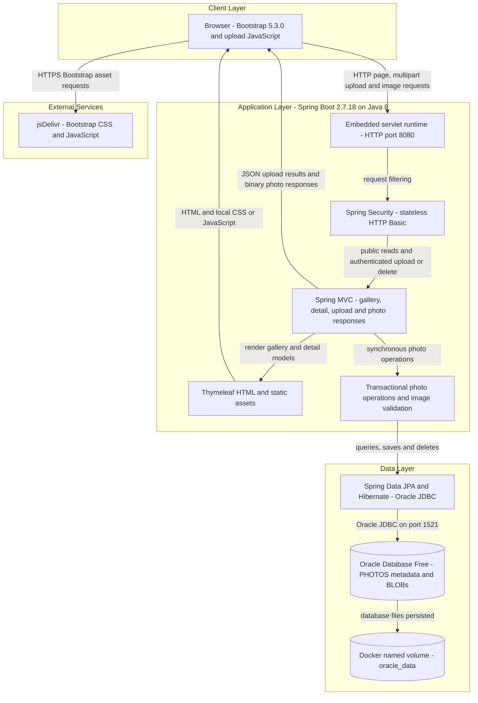
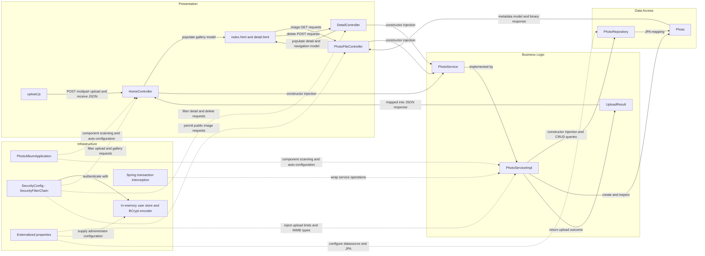

# Architecture Diagram

Photo Album is a single-module, server-rendered Java web application with synchronous photo upload, browsing, retrieval, and deletion. This source-based assessment describes the current implementation and Docker Compose configuration, not a verified running deployment; credential values are intentionally omitted.

## Application Architecture

### Technology Stack Summary

| Layer | Technology | Version | Purpose |
| --- | --- | --- | --- |
| Build and runtime | Java, Maven, executable Spring Boot JAR | Java 8; Maven image 3.9.6; Boot 2.7.18 | Single deployable application; multi-stage container build (`pom.xml:8-27,103-109`; `Dockerfile:1-31`). |
| Presentation | Spring MVC, embedded servlet container, Thymeleaf | Spring Boot 2.7.18-managed; individual versions not pinned | Server-rendered gallery and detail views, multipart upload JSON, binary image responses (`pom.xml:30-41`; controller mappings). |
| Browser | Bootstrap, JavaScript Fetch API | Bootstrap 5.3.0; browser-provided JavaScript | Responsive UI and asynchronous uploads (`templates/index.html:7,124-125`; `static/js/upload.js:97-111`, under `src/main/resources`). |
| Security | Spring Security, BCrypt, in-memory user store | Spring Boot-managed | HTTP Basic authentication for upload/delete; public reads; stateless sessions and disabled CSRF (`SecurityConfig.java:28-61`, under `src/main/java/com/photoalbum/config`). |
| Business logic | Spring transactions and Java ImageIO | Spring Boot-managed; Java 8 ImageIO | Validate file size/type, inspect dimensions, orchestrate CRUD and previous/next navigation (`PhotoServiceImpl.java:28-47,81-192,198-237`). |
| Persistence | Spring Data JPA, Hibernate, Oracle JDBC `ojdbc8` | Spring Boot-managed | Entity persistence and Oracle-native SQL (`pom.xml:43-54`; `PhotoRepository.java:16-100`). |
| Database | Oracle Database Free | Compose uses mutable `gvenzl/oracle-free:latest`; exact version unpinned | Store photo metadata and binary payloads; database files use a named volume (`docker-compose.yml:2-18,46-51`). |
| Deployment | Docker multi-stage build and Docker Compose | Temurin 8 JRE; Compose version unspecified | Application and database containers share a bridge network; app waits for database health (`Dockerfile:16-31`; `docker-compose.yml:24-51`). |
| Test-only storage | H2 in-memory database | Spring Boot-managed | Test datasource, not production storage (`pom.xml:88-93`; `src/test/resources/application-test.properties:1-10`). |

Java component paths in abbreviated citations below are relative to `src/main/java/com/photoalbum/`.

### Data Storage & External Services

Oracle is the application database. `model/Photo.java:15-41,51-91` maps `PHOTOS`, including a UUID identifier, metadata, upload timestamp, dimensions, and a `photo_data` LOB. Upload bytes are saved through JPA (`service/impl/PhotoServiceImpl.java:123-174`) and served from the database through `/photo/{id}` (`controller/PhotoFileController.java:37-83`). The retained `/uploads/` path is compatibility metadata, not the active upload-storage mechanism (`service/impl/PhotoServiceImpl.java:112-115,160-166`). Compose persists Oracle files in `oracle_data`; no upload filesystem volume is configured (`docker-compose.yml:12-14,24-47`).

Both normal and Docker properties configure Oracle JDBC and `spring.jpa.hibernate.ddl-auto=create`, so schema creation at startup can replace existing tables (`src/main/resources/application.properties:9-21`; `application-docker.properties:1-17` in the same directory). Database and administrator credentials are supplied through environment/property configuration; no literal credentials are reproduced here. Browser templates fetch Bootstrap from jsDelivr (`src/main/resources/templates/index.html:7,124`; `detail.html:7,147`). No backend cache, message broker, object-storage service, email integration, or remote API client was identified in the inspected application source.

### Key Architectural Decisions

- **Layered monolith with constructor injection:** three MVC controllers depend on `PhotoService`; its transactional implementation depends on `PhotoRepository`. Calls are synchronous and in-process, with no service-to-service messaging (`controller/HomeController.java:28-32`; `controller/DetailController.java:23-27`; `controller/PhotoFileController.java:28-32`; `service/impl/PhotoServiceImpl.java:28-47`).
- **Database-backed photo storage with Oracle coupling:** binary images and metadata share one entity; repository navigation and auxiliary queries use Oracle-specific native SQL, including `ROWNUM`, `NVL`, and `TO_CHAR` (`model/Photo.java:15-91`; `repository/PhotoRepository.java:22-100`). Gallery queries also select the BLOB column rather than using a metadata-only projection.
- **Public reads, authenticated mutations:** the filter chain protects POST `/upload` and `/detail/*/delete` using HTTP Basic, permits all other requests, disables CSRF, and uses stateless sessions. A single in-memory administrator is created with BCrypt; authentication is required but no explicit role restriction is applied to those routes (`config/SecurityConfig.java:28-61`). The browser upload code sends multipart data without implementing its own login flow (`src/main/resources/static/js/upload.js:97-106`).

## Component Relationships

### Component Inventory

| Component | Layer | Type | Responsibility |
| --- | --- | --- | --- |
| `index.html`, `detail.html` | Presentation | Thymeleaf templates | Render gallery and individual-photo metadata; link navigation, image responses, and delete forms (`src/main/resources/templates/index.html:94-110`; `detail.html:50-94`). |
| `layout.html`, `site.css` | Presentation | Shared template and stylesheet | Define shared layout markup and local styling. The index/detail templates also contain their own page markup; shared layout composition is not assumed. |
| `upload.js` | Presentation | Browser script | Submit multipart files with Fetch, process success/failure JSON, and add gallery entries referencing `/photo/{id}` and `/detail/{id}` (`src/main/resources/static/js/upload.js:97-120`; URL construction in the same file). |
| `HomeController` | Presentation | MVC controller | Handle GET `/` and POST `/upload`; map per-file upload results and photo metadata into JSON (`controller/HomeController.java:37-98`). |
| `DetailController` | Presentation | MVC controller | Handle GET `/detail/{id}`, previous/next navigation, and POST `/detail/{id}/delete` with redirect feedback (`controller/DetailController.java:18-79`). |
| `PhotoFileController` | Presentation | Binary-response MVC controller | Read BLOB bytes, return content type and no-cache headers, and handle missing photos (`controller/PhotoFileController.java:23-87`). |
| `PhotoService` | Business logic | Service interface | Define gallery reads, lookup, upload, deletion, and navigation operations (`service/PhotoService.java:13-54`). |
| `PhotoServiceImpl` | Business logic | Transactional service | Orchestrate repository calls, configured MIME/size validation, UUID naming, and ImageIO dimension inspection with a 40-million-pixel limit; read operations use read-only transactions (`service/impl/PhotoServiceImpl.java:28-75,81-192,198-237`). |
| `UploadResult` | Business logic | Result DTO | Carry success status, filename, error message, and saved photo ID to the controller (`model/UploadResult.java:6-10`). |
| `PhotoRepository` | Data access | Spring Data repository | Extend `JpaRepository<Photo, String>` for CRUD; declare native queries for ordering, navigation, month filtering, pagination, and statistics. The latter three are declared capabilities, not operations exposed by the current service interface (`repository/PhotoRepository.java:16-100`; `service/PhotoService.java:13-54`). |
| `Photo` | Data access | JPA entity | Map the photo row, BLOB, metadata, validation constraints, and upload-time index; constructor assigns UUID and timestamp (`model/Photo.java:15-105`). |
| `SecurityConfig` | Infrastructure | Spring configuration | Create security filter chain, in-memory administrator store, and BCrypt encoder; enforce authentication for the two mutation routes (`config/SecurityConfig.java:25-61`). |
| `PhotoAlbumApplication` | Infrastructure | Bootstrap entry point | Launch Spring Boot and enable component scanning/auto-configuration (`PhotoAlbumApplication.java:9-14`). |
| Application properties | Infrastructure | Externalized configuration | Configure port, datasource, schema lifecycle, multipart limits, upload validation, logging, and Docker profile overrides (`src/main/resources/application.properties:2-34`; `application-docker.properties:1-35`). |
| Spring transaction interception | Infrastructure | Framework cross-cutting concern | Apply class-level transactions and read-only overrides to photo service calls (`service/impl/PhotoServiceImpl.java:28-29,53-55,67-69,223-235`). |
| `MathUtil` | Support | Standalone utility | Provide integer GCD calculation; no role in the inspected request-to-persistence flow was identified (`util/MathUtil.java:6-20`). |

The component diagram intentionally excludes external dependencies and isolated utilities from the active interaction graph. H2 is test-only; the diagrams depict the configured application and Oracle persistence architecture rather than test execution.
