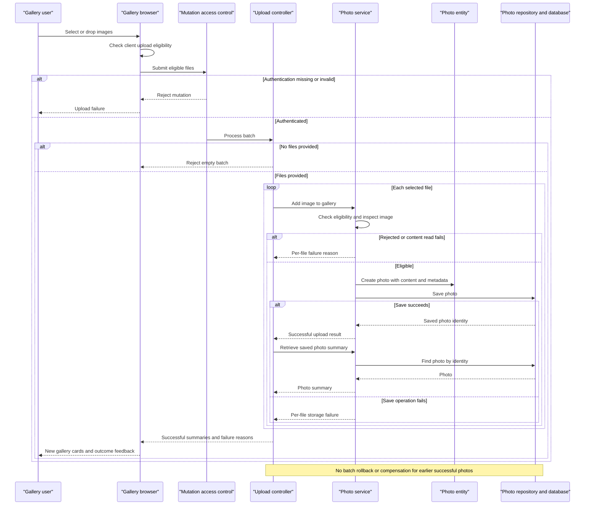

# Core Business Workflows

Photo Album lets visitors browse uploaded photographs and navigate between individual photos. Authenticated users can add multiple images to the shared gallery and permanently remove photos.

## Domain Entities

| Entity | Service / Bounded Context | Description | Key Relationships |
|---|---|---|---|
| Photo | PhotoService / Photo management | A photograph, its display metadata, and its image content; the sole persisted business entity. | Gallery membership is implicit in the collection of photos. Previous and next photos are derived from upload chronology, not explicit relationships. |
| UploadResult | PhotoService / Upload processing | Transient outcome of processing one selected file, containing success or a user-facing failure reason. Not a persisted entity or aggregate. | A successful result references the created Photo; the controller combines individual outcomes into a batch response. |

No separate Album, User ownership, tagging, or approval domain entity is implemented. The configured authentication account is an access-control principal, not a photo owner.

Evidence: `src/main/java/com/photoalbum/model/Photo.java:19-108`, `src/main/java/com/photoalbum/model/UploadResult.java:6-29`, `src/main/java/com/photoalbum/config/SecurityConfig.java:34-42`.

## Service-to-Domain Mapping

This is one application with one business service, not a collection of independently deployed business services. The following entries describe internal responsibilities.

| Service | Domain Context | Owned Entities | External Dependencies |
|---|---|---|---|
| PhotoServiceImpl | Photo management and upload processing; source of truth for business operations | Photo lifecycle and transient UploadResult | PhotoRepository and the photo database; image-header inspection |
| HomeController | Gallery presentation and batch-upload orchestration | No independent entities; composes Photo summaries and upload outcomes | PhotoService |
| DetailController | Individual-photo viewing, chronological navigation, and deletion feedback | No independent entities | PhotoService |
| PhotoFileController | Delivery of stored image content | No independent entities; reads Photo content | PhotoService |
| SecurityConfig | Mutation access control | Configured authentication principal, not domain data | Externally supplied credentials; values intentionally omitted |

All controllers operate on the same photo collection. There is no gateway, cross-context identifier exchange, or separate content-storage service.

Evidence: `src/main/java/com/photoalbum/service/impl/PhotoServiceImpl.java:28-47`, `src/main/java/com/photoalbum/controller/HomeController.java:28-31`, `src/main/java/com/photoalbum/controller/DetailController.java:23-26`, `src/main/java/com/photoalbum/controller/PhotoFileController.java:28-31`.

## Primary Workflows

### Workflow 1: Upload a batch and update the gallery

Entry point: users select or drop files in the gallery; browser code submits `POST /upload`.

1. The browser applies **Client upload eligibility**, displays local rejection messages, and submits eligible files together.
2. Access control requires authentication before the controller processes a mutation.
3. HomeController applies **Nonempty batch** and otherwise processes each file sequentially through PhotoService.
4. The service applies **Server upload eligibility**, generates a compatibility filename, reads content, and applies **Image inspection and pixel budget**.
5. An eligible file becomes a new Photo with generated identity and upload time. PhotoRepository saves image content and metadata together; no filesystem write occurs.
6. A rejected or failed file returns an unsuccessful UploadResult. On a successful result, the controller re-fetches the Photo and collects its display summary.
7. The response combines successful summaries and per-file failures using **Batch success aggregation**. Successful earlier files are not compensated when another file fails.
8. Browser code prepends cards for returned photos and displays outcome messages. Each card retrieves actual content separately by photo identity.

Failures during individual upload processing normally become per-file messages. A failure during the controller's post-save re-fetch is not caught by the upload controller: the request can fail after a photo has already been saved. If re-fetch returns no photo, that success is omitted from the response without a corresponding failure entry.

Evidence: `src/main/resources/static/js/upload.js:48-158`, `src/main/java/com/photoalbum/controller/HomeController.java:55-97`, `src/main/java/com/photoalbum/service/impl/PhotoServiceImpl.java:82-192`.

### Workflow 2: Browse the gallery and navigate photo details

Entry points: visitors open `GET /` and select a photo via `GET /detail/{id}`.

1. HomeController retrieves the shared collection using **Gallery chronology** and renders the gallery.
2. If collection retrieval fails, the gallery renders an empty photo list; the controller does not provide a distinct database-unavailable message.
3. DetailController applies **Photo lookup and navigation** and retrieves the selected Photo.
4. For an existing photo, the service queries older and newer candidates and selects the closest available neighbor in each direction.
5. The detail view receives the selected Photo and optional neighbor identities; absent neighbors have no navigation target.
6. The browser separately requests image content through `GET /photo/{id}`. PhotoFileController applies **Content availability** and returns stored bytes.

The detail controller redirects home for blank or missing identities and for lookup/navigation errors. Image delivery returns not found for missing content and a server error for other failures. Retrieval deliberately avoids reusing stale image content; there is no unavailable-service substitute image or circuit breaker.

Evidence: `src/main/java/com/photoalbum/controller/HomeController.java:37-49`, `src/main/java/com/photoalbum/controller/DetailController.java:32-58`, `src/main/java/com/photoalbum/service/impl/PhotoServiceImpl.java:225-237`, `src/main/java/com/photoalbum/controller/PhotoFileController.java:37-86`.

### Workflow 3: Confirm deletion and return to the gallery

Entry point: the detail page confirmation form submits `POST /detail/{id}/delete`.

1. The browser asks for confirmation; cancellation prevents the form submission. This is a presentation safeguard, not a server-side approval workflow.
2. Mutation access control requires authentication.
3. The service applies **Delete existence**, looks up the Photo, and deletes the complete stored record if found.
4. DetailController sets success feedback, missing-photo feedback, or generic failure feedback and redirects home.
5. The next gallery read reflects committed deletion. Subsequent image requests for the deleted identity return not found.

There is no recycle bin, soft-delete state, retention policy, filesystem cleanup, or compensating action.

Evidence: `src/main/resources/templates/detail.html` (delete form), `src/main/java/com/photoalbum/controller/DetailController.java:64-78`, `src/main/java/com/photoalbum/service/impl/PhotoServiceImpl.java:199-217`.

## Cross-Service Data Flows

No remote business-service composition, messaging, or gateway aggregation is implemented. All business data flows are internal to the application:

- **Upload composition:** browser files → HomeController → PhotoService → PhotoRepository; successful identities are re-fetched and merged into successful summary entries, while failed results supply filename/error entries.
- **Detail composition:** DetailController combines the selected Photo with separately queried previous/next identities from the same source of truth. It does not join another service's data.
- **Content delivery:** gallery/detail markup references photo identities → PhotoFileController → PhotoService → stored Photo bytes. Compatibility upload paths are not the content-serving source.
- **Degradation:** gallery lookup errors produce an empty gallery; detail failures redirect home; image failures produce not-found or server-error responses; upload errors normally produce individual failures. No circuit breaker or alternate datastore fallback is present.

Only the Photo record is persisted; upload summaries and navigation composition are response/view data. Repository methods for month filtering, pagination, and statistics have no callers in the inspected Java source and are not exposed as traced business workflows. No scheduled job, event handler, CLI business command, or business-state initialization routine was found.

Evidence: controller and service references above; `src/main/java/com/photoalbum/repository/PhotoRepository.java:64-100`, `src/main/java/com/photoalbum/PhotoAlbumApplication.java:9-14`.

## Business Workflow Sequence

The storage-failure branch represents exceptions caught during the save operation. Transaction-completion errors and uncaught post-save lookups can instead fail the request outside this normal response path.

## Business Rules & Decision Logic

| Rule | Implemented decision or constraint |
|---|---|
| Client upload eligibility | Browser accepts declared JPEG, PNG, GIF, or WebP MIME types and at most 10 MiB per file. Client checks do not reject empty files or enforce a file-count limit. |
| Nonempty batch | Controller returns a bad-request result for a null or empty submitted file list. |
| Server upload eligibility | Service lowercases the declared MIME type and checks the configured allowlist, rejects files over the configured size limit, then rejects zero-length files. Current configuration allows the four image types and 10 MiB. A missing MIME type enters the generic error path rather than the explicit unsupported-type branch. |
| Image inspection and pixel budget | Image headers are inspected without fully decoding. When a reader supplies dimensions, width multiplied by height must not exceed 40,000,000 pixels. An IOException rejects the file; other inspection exceptions allow processing to continue without dimensions. No available reader also allows an upload without dimensions: an allowed declared MIME type does not guarantee verified image content. |
| Entity validity | Original and stored filenames must be nonblank and at most 255 characters; compatibility path is at most 500 characters; declared MIME type is nonblank and at most 50 characters; file size must be present and positive; upload time must be present. These are Photo validation annotations, not explicit controller field-validation steps. |
| Batch success aggregation | Overall success is true only when at least one saved photo is re-fetched and added to the successful summary list. Nonempty processed batches return an OK response even if every individual file fails. |
| Gallery chronology | Gallery ordering is newest upload first. Previous means strictly older, ordered newest among older candidates; next means strictly newer, ordered oldest among newer candidates. The service uses the first result. Equal timestamps are excluded from neighbor queries and have no explicit gallery tie-breaker. |
| Photo lookup and navigation | Blank or missing detail identities redirect to the gallery; any detail lookup/navigation exception does likewise. Neighbor absence is allowed. |
| Content availability | Blank/missing identity or absent/empty stored bytes returns not found. Other delivery exceptions return a server error. |
| Delete existence | Missing photos return false without deletion; existing photos are permanently removed. Errors become runtime failures handled by the controller's generic deletion message. |
| Mutation access | Upload and delete require authentication. The configured account has an administrator role, but route rules check authentication rather than explicitly requiring that role. Gallery, detail, and image reads are public. No per-photo ownership checks exist. |
| Configured versus enforced capacity | Multipart configuration limits each file to 10 MB and each request to 50 MB before business processing. A configured ten-files-per-upload setting is not consumed by the inspected browser/controller/service code and is not an enforced business rule. |

**Lifecycle and derived values:** selected file → rejected outcome or persisted Photo → permanent deletion. There is no persisted status machine. Constructors assign a random photo identity and current upload time; the service separately generates a random compatibility filename, retaining the supplied extension. Dimensions are optional inspected metadata. Display dates, size units, and navigation targets are derived for presentation.

**Transactions and consistency:** PhotoServiceImpl is transactional at class level; read and navigation methods use read-only transactions. HomeController is not transactional, so individual service uploads are not one atomic batch. Save exceptions are caught inside the service, but transaction commit failures can escape at the proxy boundary; the implementation does not guarantee every storage failure becomes an UploadResult. Deletion exceptions propagate as runtime failures. No saga, event publication, or asynchronous consistency mechanism is implemented.

**Errors and audit:** service/controller logging records upload success or rejection, photo retrieval, deletion, and errors. Image-serving diagnostics also log a short byte prefix. These are application logs, not a durable business audit trail with actor attribution. User-facing errors are generic; no application-specific business exception hierarchy is implemented.

**Authorization presentation:** the application uses per-request Basic authentication with stateless access control and disabled CSRF protection. The inspected upload script and delete form contain no dedicated login workflow. Credential values, connection strings, and image contents are intentionally not included in this assessment.

Evidence: `src/main/resources/static/js/upload.js:60-132`; upload/multipart keys in `src/main/resources/application.properties` and `application-docker.properties`; `src/main/java/com/photoalbum/service/impl/PhotoServiceImpl.java:28-35,54-75,82-192,199-249`; `src/main/java/com/photoalbum/model/Photo.java:31-107`; `src/main/java/com/photoalbum/repository/PhotoRepository.java:22-56`; `src/main/java/com/photoalbum/config/SecurityConfig.java:34-61`; controller references above.
