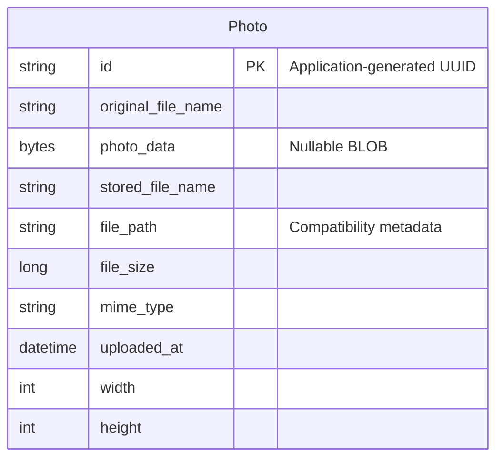

# Data Architecture & Persistence Layer

The data layer contains one JPA entity, `Photo`, persisted through Spring Data JPA/Hibernate to Oracle, with H2 configured for tests. Image bytes and metadata share a single database table; no separate object store is used by the inspected persistence code.

## Database Configuration

| Service/Module | DB Type | Profile | Driver | Connection | Migration Tool |
|---|---|---|---|---|---|
| Photo Album | Oracle | Default | `com.oracle.database.jdbc:ojdbc8`; `oracle.jdbc.OracleDriver` | Environment-overridable Oracle Thin connection to a database service; credentials supplied externally and omitted here | None detected; Hibernate recreates the mapped schema at application startup |
| Photo Album | Oracle | `docker` | Same Oracle JDBC driver | Same environment-overridable Oracle connection behavior | None detected; Hibernate recreates the mapped schema at application startup |
| Photo Album tests | H2 | `test` | Test-scoped `com.h2database:h2`; `org.h2.Driver` | In-memory database with test-local authentication; credentials omitted | None detected; Hibernate creates the schema and drops it on shutdown |

- Connection pool: no explicit pool selection, pool size, timeout, or connection lifetime settings were found. The JPA starter normally supplies HikariCP through its JDBC dependencies; this is a framework default, not a repository-defined tuning policy.
- Schema authority: entity mappings drive table/index creation. Recreating the Oracle schema on startup is destructive to existing mapped data; this is not a versioned migration strategy.
- `oracle-init/01-create-user.sql:1-30` grants application-schema privileges and sets tablespaces/quota. It does not define the `photos` table or seed photos. `02-verify-user.sql` inspects the schema account/privileges; `healthcheck.sql` performs a connectivity query.
- No Flyway/Liquibase dependency, versioned migration, photo seed script, or programmatic photo seeding was found in the inspected source and SQL files.
- The H2 profile does not establish Oracle SQL compatibility: repository queries use Oracle-specific constructs, while the existing test only loads the application context.
- See `configuration-inventory.md` for the full property inventory. Connection literals and authentication values are deliberately omitted from this document.

**Evidence:** `pom.xml:43-54,88-93`; `src/main/resources/application.properties:9-21`; `src/main/resources/application-docker.properties:1-17`; `src/test/resources/application-test.properties:1-10`; `src/test/java/com/photoalbum/PhotoAlbumApplicationTests.java:7-14`.

## Data Ownership per Service

| Service | Tables Owned | ORM Framework | Caching | Notes |
|---|---|---|---|---|
| Photo Album / `PhotoServiceImpl` | `photos` | Spring Data JPA and Hibernate; `javax.persistence` mappings | No explicit application or ORM second-level cache found | Photo BLOBs and metadata belong to the same entity. No account, album, outbox, or join-table entity was found. |

**Evidence:** `src/main/java/com/photoalbum/model/Photo.java:15-19`; `src/main/java/com/photoalbum/repository/PhotoRepository.java:15-16`; `src/main/java/com/photoalbum/service/impl/PhotoServiceImpl.java:28-37,160-174`.

## Entity Model

There are no mapped entity relationships or foreign keys; therefore the diagram has no cardinality edges. No bidirectional/unidirectional associations, cascade rules, or relationship-fetch settings apply.

| Java field | Java type | Column / persistence characteristics |
|---|---|---|
| `id` | `String` | Primary key; length 36; UUID assigned by the default constructor, not a database sequence |
| `originalFileName` | `String` | `original_file_name`; non-null; length 255 |
| `photoData` | `byte[]` | `photo_data`; nullable large object; no lazy-fetch override is declared |
| `storedFileName` | `String` | `stored_file_name`; non-null; length 255; no unique constraint declared |
| `filePath` | `String` | `file_path`; nullable; length 500; compatibility metadata, not a file-system storage pointer used by the current implementation |
| `fileSize` | `Long` | `file_size`; non-null; explicitly mapped to Oracle `NUMBER(19,0)` |
| `mimeType` | `String` | `mime_type`; non-null; length 50 |
| `uploadedAt` | `LocalDateTime` | `uploaded_at`; non-null; Oracle timestamp with database default; constructor also assigns an application-local timestamp |
| `width`, `height` | `Integer` | Nullable image dimensions |

- A non-unique index, `idx_photos_uploaded_at`, supports upload-time access. No optimistic-lock version field is present.
- `UploadResult` is an unpersisted result DTO, not a second entity/table.
- `PhotoServiceImpl` has a class-level transaction boundary for writes, with read-only overrides on retrieval/navigation methods. No custom isolation or propagation configuration is declared.
- Every custom photo query selects the BLOB as well as metadata; there is no metadata-only projection. The statistics query additionally returns scalar analytical columns.

**Evidence:** `src/main/java/com/photoalbum/model/Photo.java:15-96`; `src/main/java/com/photoalbum/model/UploadResult.java:6-10`; `src/main/java/com/photoalbum/service/impl/PhotoServiceImpl.java:28-30,53-69,223-237`.

## Key Repository Methods

All methods below belong to `PhotoRepository extends JpaRepository<Photo, String>` in `src/main/java/com/photoalbum/repository/PhotoRepository.java`. Standard inherited CRUD methods are omitted from the table; the service uses inherited operations for identifier lookup, saving, and deletion.

| Service | Repository | Notable Methods | Purpose |
|---|---|---|---|
| Photo Album | `PhotoRepository` | `List<Photo> findAllOrderByUploadedAtDesc()` | Native SQL returns all photos, including BLOBs, newest first; no result limit |
| Photo Album | `PhotoRepository` | `List<Photo> findPhotosUploadedBefore(LocalDateTime uploadedAt)` | Native SQL selects older photos using an upload-time predicate and descending ordering; outer Oracle `ROWNUM` limits results to at most 10 |
| Photo Album | `PhotoRepository` | `List<Photo> findPhotosUploadedAfter(LocalDateTime uploadedAt)` | Native SQL selects newer photos in ascending order, substituting a default string for null paths with `NVL`; no result limit |
| Photo Album | `PhotoRepository` | `List<Photo> findPhotosByUploadMonth(String year, String month)` | Native SQL filters the timestamp using Oracle `TO_CHAR` year/month expressions |
| Photo Album | `PhotoRepository` | `List<Photo> findPhotosWithPagination(int startRow, int endRow)` | Native SQL uses nested Oracle `ROWNUM` queries to retrieve an inclusive row interval over newest-first results |
| Photo Album | `PhotoRepository` | `List<Object[]> findPhotosWithStatistics()` | Native SQL returns photo columns plus file-size `RANK` and upload-time running `SUM`; untyped scalar-array result |

The timestamp, year/month, and row-bound parameters are bound with `@Param`. There are no derived custom finders, named queries, stored-procedure calls, or cross-service bulk-ID aggregation methods. Month filtering, pagination, and statistics are declared but are not called by the inspected `PhotoServiceImpl`; its custom repository calls are the ordered list and before/after queries.

**Evidence:** `src/main/java/com/photoalbum/repository/PhotoRepository.java:16-100`; `src/main/java/com/photoalbum/service/impl/PhotoServiceImpl.java:55-71,174,210,225-237`.

## Caching Strategy

| Layer | Observed strategy | TTL / eviction / rationale |
|---|---|---|
| Application/repository results | No Spring Cache annotations, cache-manager configuration, Redis, Ehcache, Caffeine, or JCache provider dependency found in inspected source/build files | No configured regions, TTLs, invalidation, or cache-aside/read-through/write-through policy |
| Hibernate | Ordinary persistence-context identity tracking can exist within a transaction; no explicit second-level or query-cache configuration found | Transaction-scoped first-level context is not a shared result cache |
| Photo response caching | Photo-byte responses explicitly prohibit storage and request revalidation; no server-side byte cache exists in the inspected controller | No retention TTL; the code labels this as aggressive no-cache behavior but provides no broader caching rationale |
| Authentication/session state | Administrator details held in an in-memory user manager; security configured without sessions | This is process-local authentication state, not a distributed session cache |

**Evidence:** `pom.xml:30-101`; `src/main/java/com/photoalbum/controller/PhotoFileController.java:57-79`; `src/main/java/com/photoalbum/config/SecurityConfig.java:33-43,46-60`.

## Data Ownership Boundaries

One application module accesses one datasource per active configuration. Its photo service reads and writes the same `photos` table through one repository; there is no database-per-service topology, shared database across independently implemented services, cross-service database access, remote data aggregation, or CQRS read-store separation evidenced in the inspected code. H2 is an isolated test substitute, not a separate production owner.

Image content and metadata are stored together, not split between SQL and object storage. `filePath` and generated stored filenames remain compatibility metadata; current retrieval obtains BLOB bytes from the entity. There is no persisted user/tenant owner identifier or row-level ownership relationship. All table access uses the application schema account; SQL initialization grants schema-object creation privileges and an unlimited quota on the default data tablespace.

**Evidence:** `src/main/java/com/photoalbum/service/impl/PhotoServiceImpl.java:112-124,160-174,198-210`; `src/main/java/com/photoalbum/controller/PhotoFileController.java:46-58`; `oracle-init/01-create-user.sql:14-30`.

### Data Classification & Sensitivity

| Entity | Sensitive Fields | Classification (PII/PHI/PCI/None) | Controls in Place |
|---|---|---|---|
| `Photo` | `photoData` may depict identifiable people or contain embedded identifying metadata; `originalFileName` may contain names or other identifiers | Potential PII; actual image contents are not known. No explicit PHI or PCI fields detected. | Reads are publicly accessible in the inspected security configuration; state-changing operations require authentication. No per-photo ownership checks, field-level access controls, masking, or application-layer encryption found. Encryption-at-rest is not configured or demonstrated by inspected persistence files; infrastructure-level encryption cannot be confirmed. |
| `Photo` | UUID, generated filename/path, size, MIME type, upload time, dimensions | None intrinsically; contextual metadata may become identifying when linked to photo content | No separate field masking or field-level access policy found |

Authentication credentials are not database entities: an externally supplied administrator password is BCrypt-encoded for the in-memory user manager. Database and administrator credential values are excluded from this report. Photo filenames are logged by the service/controller and `Photo.toString()` exposes metadata; the photo-serving controller also logs a small byte sample. No masking is apparent in those code paths.

**Evidence:** `src/main/java/com/photoalbum/model/Photo.java:24-91,201-213`; `src/main/java/com/photoalbum/config/SecurityConfig.java:28-42,54-60`; `src/main/java/com/photoalbum/service/impl/PhotoServiceImpl.java:179-184`; `src/main/java/com/photoalbum/controller/PhotoFileController.java:53-66`.
