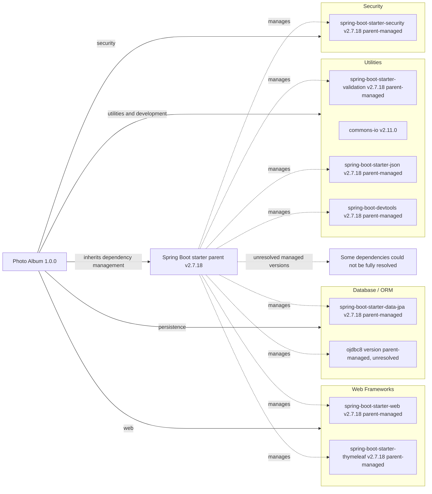

# Dependency Map

Photo Album (`com.photoalbum:photo-album:1.0.0`) declares 11 external dependencies in `pom.xml`: nine non-test dependencies and two test-scoped dependencies. The Spring Boot parent and build plugin are recorded separately and are not included in that count; this map describes declarations, not a resolved transitive dependency tree.

## Dependencies

### Dependency Summary

| Category | Count | Key Libraries | Notes |
|----------|-------|---------------|-------|
| Web Frameworks | 2 | `org.springframework.boot:spring-boot-starter-web`, `org.springframework.boot:spring-boot-starter-thymeleaf` | Both compile scope; versions omitted, managed by Spring Boot parent 2.7.18. |
| Database / ORM | 2 | `org.springframework.boot:spring-boot-starter-data-jpa`, `com.oracle.database.jdbc:ojdbc8` | JPA starter: compile, parent-managed 2.7.18. Oracle driver: runtime, version omitted and exact managed version not resolved from local build files. |
| Security | 1 | `org.springframework.boot:spring-boot-starter-security` | Compile scope; parent-managed 2.7.18. |
| Utilities | 4 | `org.springframework.boot:spring-boot-starter-validation`, `commons-io:commons-io:2.11.0`, `org.springframework.boot:spring-boot-starter-json`, `org.springframework.boot:spring-boot-devtools` | All compile scope. Spring Boot artifacts are parent-managed 2.7.18; Commons IO is explicitly pinned. DevTools is optional, not test-scoped. |
| **Total non-test dependencies** | **9** | | Default Maven scope is compile when omitted. |

Parent: `org.springframework.boot:spring-boot-starter-parent:2.7.18` (`pom.xml:8–13`). No explicit BOM import, additional modules, or dependency lockfile was found. Spring Boot artifact versions above follow the parent release; the inherited BOM contents and full transitive versions were not available in the workspace and were not independently resolved. Build tooling: `org.springframework.boot:spring-boot-maven-plugin`, with no explicit version, managed through the parent (`pom.xml:103–110`).

### Version & Compatibility Risks

Spring Boot 2.7.18 is a legacy release outside its original open-source support window. Moving to Spring Boot 3 requires Java 17 or later and the Java EE to Jakarta namespace transition; this POM currently targets Java 8 (`pom.xml:23–28`), so framework, persistence, validation, and security compatibility need coordinated review. Commons IO 2.11.0 is an older pinned release and merits an advisory/version review. Exact Oracle JDBC and H2 managed versions remain unresolved here, so their compatibility or vulnerability status cannot be established from these declarations alone; this map is not a vulnerability scan.

### Notable Observations

- Dependency declarations are in `pom.xml:30–101`; no additional recognized Java, .NET, JavaScript, or TypeScript package manifests were found.
- `spring-boot-starter-json` is explicitly declared alongside the web starter, which normally brings JSON support transitively. Despite the POM's “Image processing” comment, this artifact supplies JSON support, not an image-processing library.
- Optional DevTools remains a compile-scoped declaration and is included in the non-test count. Optionality affects propagation to downstream consumers; it is not a test scope.
- No standalone messaging, caching, logging, or observability dependency is declared. Starter-provided transitive libraries are not counted as direct dependencies or assigned unverified versions.

## Test Dependencies

| Framework | Version | Notes |
|-----------|---------|-------|
| `org.springframework.boot:spring-boot-starter-test` | 2.7.18, parent-managed; no explicit version | Test scope (`pom.xml:81–86`). Aggregate test starter normally supplies JUnit Jupiter, Mockito, AssertJ, and Spring testing support transitively; their individual versions are not resolved here. |
| `com.h2database:h2` | Parent-managed; exact version unresolved | Test scope (`pom.xml:88–93`). In-memory database support; not itself a test runner. |

Total test-scope dependencies: 2

The test starter follows the legacy Spring Boot baseline. No dedicated Testcontainers or contract-testing library is declared; H2-based tests alone do not establish Oracle database behavioral equivalence, and build declarations do not prove which tests actually execute.
